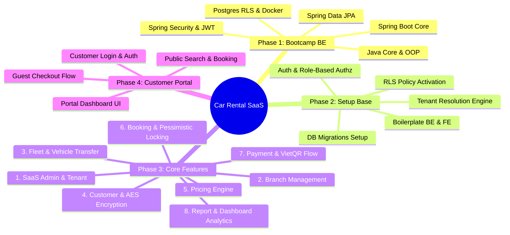
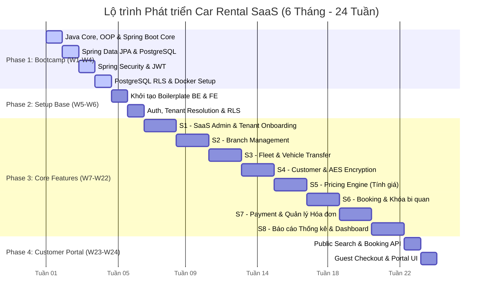

# 📊 Sơ đồ Trực quan Lộ trình Dự án (Mindmap & Gantt Chart)

Tài liệu này cung cấp mã nguồn biểu đồ để bạn vẽ tự động các sơ đồ trực quan (Sơ đồ tư duy & Biểu đồ Gantt tiến độ) phục vụ cho việc nhúng vào slide hoặc báo cáo dự án.

Bạn chỉ cần copy mã nguồn tương ứng bên dưới và dán vào trang **[Mermaid Live Editor](https://mermaid.live)** để tạo và tải hình ảnh chất lượng cao (PNG/SVG) về máy.

---

## 🧠 1. Sơ đồ Tư duy Lộ trình (Mindmap Roadmap)

Đoạn mã này hiển thị cấu trúc nội dung cốt lõi của từng giai đoạn phát triển:



---

## 📅 2. Biểu đồ Gantt Tiến độ (Gantt Chart Timeline)

Đoạn mã này hiển thị chi tiết tiến độ thực hiện theo từng tuần của 4 giai đoạn phát triển trong vòng **6 tháng (24 tuần)**, hiển thị trục thời gian chuẩn từ **Tuần 01 đến Tuần 24**:



---

## 🖼️ Hướng dẫn chèn hình ảnh vào báo cáo

1. Truy cập **[Mermaid Live Editor](https://mermaid.live)**.
2. Dán mã code tương ứng vào ô biên tập.
3. Nhấp vào nút **Download** ở góc dưới cùng bên trái và tải về định dạng **PNG** hoặc **SVG**.
4. Lưu hình ảnh vào dự án của bạn (ví dụ: `docs/assets/mindmap.png` và `docs/assets/gantt.png`).
5. Sử dụng cú pháp sau để hiển thị trong Markdown:

```markdown


```
