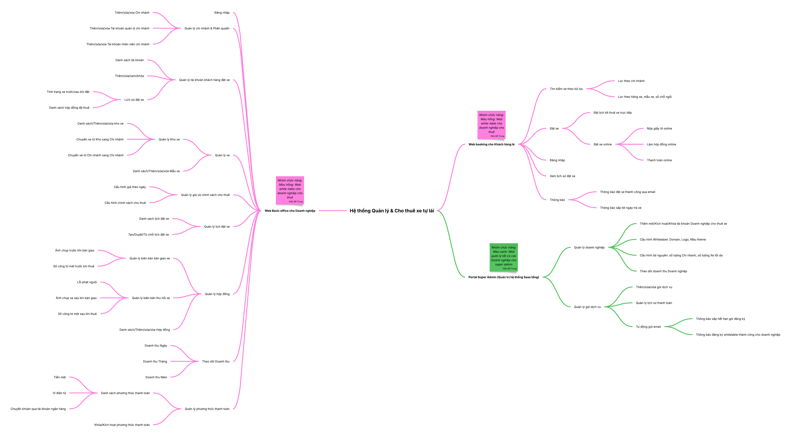
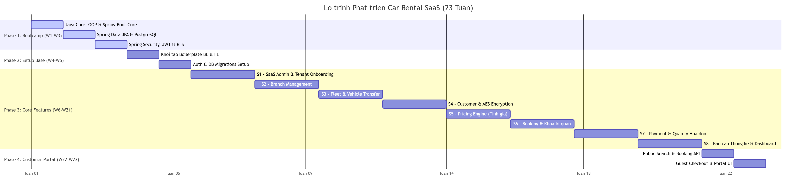

# BÁO CÁO LỘ TRÌNH PHÁT TRIỂN DỰ ÁN CAR RENTAL SAAS
> **Đặc tả nghiệp vụ áp dụng:** [API-Specification.md](API-Specification.md)  
> **Thời gian cập nhật:** 19/06/2026

Lộ trình này được thiết lập nhằm phân bổ tối ưu nguồn lực cho một nhóm phát triển gồm 3 thành viên làm việc dưới hình thức **part-time (30-40% quỹ thời gian)**. Trong bối cảnh nhóm dự án **chưa có kinh nghiệm thực tế về công nghệ Backend (Java/Spring Boot)** nhưng đã **làm chủ các công nghệ Frontend**, lộ trình được cấu trúc thành **4 giai đoạn (Phase) cuốn chiếu** với tổng thời gian thực hiện chuẩn hóa là **23 tuần (gần 6 tháng)**.

Dự án áp dụng triệt để mô hình **API-First Development**. Việc thống nhất sớm hợp đồng API (API Contract) cho phép đội ngũ Frontend dựng Mock Server để phát triển giao diện độc lập và chạy thử các luồng nghiệp vụ mà không cần phụ thuộc vào tiến độ xây dựng API thật từ phía Backend.

---

## 📊 Sơ đồ Lộ trình Tổng thể (High-Level Timeline)

Để có cái nhìn tổng quan và theo dõi trực quan hơn, dưới đây là Sơ đồ tư duy (Mindmap) phân rã công việc và Biểu đồ Gantt (Gantt Chart) tiến độ thực hiện chi tiết theo tuần của dự án:

### 🧠 1. Sơ đồ tư duy phân rã công việc (Mindmap)


### 📅 2. Biểu đồ Gantt tiến độ thực hiện (Gantt Chart)


```
                              [ 23 TUẦN / GẦN 6 THÁNG - PART-TIME ]
 
   Phase 1: Bootcamp BE       Phase 2: Setup Base        Phase 3: Core Features     Phase 4: Customer Portal
  ┌──────────────────────┐   ┌──────────────────────┐   ┌──────────────────────┐   ┌──────────────────────┐
  │ • Java OOP / Spring  │   │ • Khởi tạo dự án     │   │ • Phát triển song    │   │ • Public Search APIs │
  │ • Database & JPA     │   │ • Auth & Security    │   │   song BE + FE       │   │ • Đặt xe không Acc   │
  │ • Spring Security    │   │ • Thiết kế DB Schema │   │ • 2 tuần / Service   │   │ • Customer Portal UI │
  │                      │   │ • Phân giải Tenant   │   │ • 8 Dịch vụ cốt lõi  │   │ • Thanh toán chuyển  │
  └──────────┬───────────┘   └──────────┬───────────┘   └──────────┬───────────┘   └──────────┬───────────┘
             ▼                          ▼                          ▼                          ▼
         Tuần 1 - 3                 Tuần 4 - 5                 Tuần 6 - 21                Tuần 22 - 23
```

---

## 📌 NỘI DUNG CHI TIẾT CÁC GIAI ĐOẠN

### 📚 Phase 1: Học tập & Nghiên cứu Công nghệ Backend (Weeks 1 - 3)
* **Mục tiêu:** Đồng bộ hóa kiến thức nền tảng về Java, Spring Boot, Cơ sở dữ liệu và các giải pháp kiến trúc Backend cho toàn bộ thành viên dự án, nhằm tận dụng tối đa khả năng cộng tác chéo và hỗ trợ lẫn nhau trong các giai đoạn sau.
* **Thời gian:** 3 tuần.

#### 📖 Nội dung học tập và thực hành chi tiết:
1. **Tuần 1: Lập trình Java Core, Hướng đối tượng & Spring Boot Core**
   - Nắm vững cú pháp Java Core, các cấu trúc dữ liệu nâng cao (Collections Framework, Stream API, Generics).
   - Hiểu sâu các nguyên lý thiết kế hướng đối tượng (OOP: Kế thừa, Đa hình, Đóng gói, Trừu tượng).
   - Nghiên cứu cơ chế cốt lõi của Spring Boot: Dependency Injection (DI) & Inversion of Control (IoC), Spring Beans, Application Context.
   - Thiết kế RESTful API tiêu chuẩn sử dụng các Annotation chính (`@RestController`, `@RequestMapping`, `@RequestBody`, `@PathVariable`, `@RequestParam`).
2. **Tuần 2: Thiết kế Cơ sở dữ liệu & Spring Data JPA**
   - Thiết kế cơ sở dữ liệu quan hệ (PostgreSQL), tối ưu hóa liên kết (khóa ngoại, quan hệ 1-N, N-N) và cơ chế đánh chỉ mục (Indexing).
   - Cấu hình Hibernate/JPA: Thực hiện ánh xạ thực thể (Entity Mapping) qua các annotation quan hệ (`@OneToMany`, `@ManyToOne`, `@ManyToMany`, `@JoinColumn`).
   - Sử dụng Spring Data JPA Repository: Custom query methods, JPQL, Native SQL, cơ chế phân trang (Pagination) và sắp xếp (Sorting).
3. **Tuần 3: Spring Security, JWT & PostgreSQL Row Level Security (RLS)**
   - Tìm hiểu cơ chế hoạt động của Spring Security Filter Chain.
   - Triển khai luồng Token-based Authentication: Tạo, ký và giải mã JSON Web Token (JWT) để định danh người dùng.
   - Thiết lập cơ chế phân quyền dựa trên vai trò (RBAC - Role-Based Access Control) thông qua cấu hình bảo mật hệ thống và Annotation `@PreAuthorize`.
   - Tìm hiểu các mô hình lưu trữ đa ứng dụng (Multi-tenant) đặc trưng cho mô hình SaaS.
   - Nghiên cứu giải pháp cô lập dữ liệu an toàn ở tầng Database sử dụng **PostgreSQL Row Level Security (RLS)**.
   - Cấu hình session context trong Spring Boot để gán mã `tenant_id` động xuống PostgreSQL theo từng request kết nối.
   - Xây dựng Docker Compose hoàn chỉnh chạy môi trường phát triển (PostgreSQL, Redis).

#### 📦 Kết quả đầu ra (Deliverables Phase 1):
- [ ] Tự code API CRUD bảo mật JWT.
- [ ] Thiết lập thành công môi trường Docker Compose dùng chung cho toàn đội ngũ phát triển.

---

### 🏗️ Phase 2: Khởi tạo Base Dự án & Thiết kế Cơ sở dữ liệu (Weeks 4 - 5)
* **Mục tiêu:** Xây dựng khung kiến trúc chuẩn (Boilerplate) cho cả Backend và Frontend, hoàn thiện thiết kế lược đồ cơ sở dữ liệu, triển khai hệ thống xác thực tập trung và cơ chế cô lập dữ liệu nhà xe (Tenant Isolation).
* **Thời gian:** 2 tuần (0.5 tháng).

```
                            SƠ ĐỒ XÁC THỰC & PHÂN GIẢI TENANT
                          
  Client Request          Next.js Middleware             Spring Boot Backend           PostgreSQL DB
 ┌──────────────┐       ┌────────────────────┐         ┌─────────────────────┐      ┌─────────────────┐
 │ Subdomain /  │ ───>  │ • Check JWT        │  ───>   │ • TenantInterceptor │ ───> │ • Set tenant_id │
 │ Headers      │       │ • Route Guarding   │         │ • Resolve Tenant ID │      │ • Apply RLS     │
 └──────────────┘       └────────────────────┘         └─────────────────────┘      └─────────────────┘
```

#### ⚙️ Nhiệm vụ chi tiết:
1. **Khởi tạo và cấu hình Project Base:**
   - **Backend (Spring Boot 3.x, Java 17):** Khởi tạo khung dự án, cấu hình quản lý lỗi tập trung (Global Exception Handler), tích hợp tài liệu tự động Swagger/OpenAPI.
   - **Frontend (Next.js 14, App Router, TailwindCSS):** Cấu hình cấu trúc thư mục dự án Next.js, tích hợp UI Component Library (Shadcn UI / Ant Design), cấu hình Axios/Fetch client với interceptors để tự động đính kèm JWT Token và `X-Tenant-ID`.
2. **Triển khai Cơ chế Xác thực & Phân quyền (Authentication & Authorization):**
   - Xây dựng hoàn chỉnh các API Endpoint xác thực bảo mật:
     - `POST /auth/login` (Hỗ trợ đăng nhập cho cả đối tượng Quản trị hệ thống - Super Admin và Nhân viên nhà xe - Tenant User).
     - `POST /auth/register` (Quy trình đăng ký Tenant mới - tạo đồng thời bản ghi Tenant và tài khoản Quản trị nhà xe - Tenant Admin).
     - `POST /auth/refresh` (Cơ chế gia hạn access token tự động sử dụng refresh token).
   - Thiết lập cấu trúc phân vai trò hệ thống: `SUPER_ADMIN`, `TENANT_ADMIN`, `STAFF`, `CUSTOMER`.
   - Phía Frontend: Implement AuthContext toàn cục và Next.js Middleware để thực hiện Route Guarding (chặn và điều hướng truy cập trái phép).
3. **Hiện thực hóa Multi-Tenant Engine:**
   - Cấu hình lớp `TenantContext` sử dụng ThreadLocal trong Spring Boot để lưu trữ an toàn Tenant ID theo từng luồng request xử lý.
   - Xây dựng Interceptor bắt header `X-Tenant-ID` hoặc phân tích domain/subdomain từ request để set vào `TenantContext`.
   - Thiết lập công cụ di chuyển dữ liệu DB Migration (Flyway hoặc Liquibase), bắt buộc cột `tenant_id` trên tất cả các bảng dữ liệu liên quan đến nghiệp vụ nhà xe.
   - Kích hoạt chính sách PostgreSQL RLS (Row Level Security):
     - Tự động áp dụng bộ lọc `tenant_id = current_setting('app.current_tenant_id')` cho mọi truy vấn (SELECT/INSERT/UPDATE/DELETE).
     - Cấu hình chính sách Bypass RLS đặc quyền dành riêng cho tài khoản quản trị hệ thống (`SUPER_ADMIN`).

#### 📦 Kết quả đầu ra (Deliverables Phase 2):
- [ ] Giao diện Đăng nhập/Đăng ký trên Frontend kết nối và xử lý dữ liệu thực tế thành công với Backend.
- [ ] Token JWT mã hóa và truyền tải chính xác thông tin định danh vai trò (Role) và mã định danh nhà xe (Tenant ID).
- [ ] Kịch bản kiểm thử (Test Case) tự động chứng minh tính cô lập hoàn toàn của dữ liệu ở tầng cơ sở dữ liệu (Tenant A tuyệt đối không thể đọc hay can thiệp dữ liệu của Tenant B).
- [ ] Thiết kế và hoàn thiện 02 Sơ đồ Kiến trúc hệ thống (Architecture Diagram):
  - **High-Level Architecture**: Sơ đồ kiến trúc tổng quan hệ thống (Client, Load Balancer, Gateway, Services, Caching, Databases).
  - **Database Architecture**: Sơ đồ chi tiết thiết kế Cơ sở dữ liệu và cơ chế cô lập Tenant (RLS, Schema, Tables, Relationships).

---

### 💻 Phase 3: Phát triển Các Module Nghiệp vụ Cốt lõi (Weeks 6 - 21)
* **Mục tiêu:** Phát triển toàn bộ các API Backend nghiệp vụ và tích hợp giao diện tương ứng cho hai module lớn: **SaaS Admin Portal** (Dành cho Quản trị hệ thống) và **Tenant Dashboard** (Dành cho Quản trị & Nhân viên nhà xe).
* **Quy trình triển khai:** Áp dụng phương thức phát triển cuốn chiếu **2 tuần / Module**. BE phát triển API kết hợp viết tài liệu, FE dựng giao diện sử dụng dữ liệu Mock trong tuần đầu tiên và tiến hành tích hợp thật trong tuần thứ hai.

```
  ┌─────────────────────────────────────────────────────────────────────────────────────────────┐
  │                           QUY TRÌNH PHÁT TRIỂN 2 TUẦN / SERVICE                            │
  ├─────────────────────────────────────────┬───────────────────────────────────────────────────┤
  │                 Tuần 1                  │                      Tuần 2                       │
  ├─────────────────────────────────────────┼───────────────────────────────────────────────────┤
  │ BE: Code các thực thể & logic nghiệp vụ │ BE: Viết Unit/Integration Tests, tối ưu truy vấn  │
  │ FE: Dựng layout UI, Mock API Endpoint   │ FE: Tích hợp API thật, xử lý validate và lỗi      │
  └─────────────────────────────────────────┴───────────────────────────────────────────────────┘
```

#### 🗓️ Nội dung chi tiết 8 Module Nghiệp vụ (2 tuần/mô-đun):

#### 1. Module 1: Quản trị Đối tác (Super Admin & Tenant APIs) (Weeks 6 - 7)
* **API tham chiếu:** **[3. Super Admin APIs](API-Specification.md#3-super-admin-apis)** & **[4. Tenant APIs](API-Specification.md#4-tenant-apis)**
* **Nhiệm vụ Backend:**
  - `GET /super-admin/tenants` (Truy vấn danh sách nhà xe đối tác, hỗ trợ tìm kiếm và phân trang).
  - `PATCH /super-admin/tenants/{tenantId}/status` (Thay đổi trạng thái kích hoạt/khóa tài khoản Tenant).
  - `POST /super-admin/subscriptions/billing-approval` (Kiểm duyệt và phê duyệt giao dịch gia hạn gói cước của đối tác).
  - `GET /super-admin/dashboard/stats` (Thống kê doanh thu toàn hệ thống).
  - `GET /tenants/me` & `PUT /tenants/me` (Cập nhật hồ sơ của Tenant).
* **Nhiệm vụ Frontend:**
  - **SaaS Admin Portal:** Trang dashboard quản trị tổng thể, quản lý danh sách Tenant, phê duyệt giao dịch gói cước và biểu đồ doanh thu.
  - **Tenant Dashboard:** Màn hình Settings nhà xe (Tên nhà xe, logo, thông tin liên hệ).
  
#### 2. Module 2: Quản lý Chi nhánh (Branch APIs) (Weeks 8 - 9)
* **API tham chiếu:** **[5. Branch APIs](API-Specification.md#5-branch-apis)** (Mã mục lục 4. Branch APIs trong markdown)
* **Nhiệm vụ Backend:**
  - `GET /branches` (Truy vấn danh sách chi nhánh trực thuộc Tenant, lọc theo chi nhánh trung tâm).
  - `POST /branches` (Tạo mới chi nhánh).
  - `GET /branches/{branchId}` & `PUT /branches/{branchId}` (Xem chi tiết và cập nhật thông tin chi nhánh).
  - `DELETE /branches/{branchId}` (Xóa chi nhánh, đi kèm kiểm tra ràng buộc nghiệp vụ).
* **Nhiệm vụ Frontend (Tenant Dashboard):**
  - Giao diện quản lý danh sách chi nhánh (dạng bảng kết hợp bản đồ/thẻ) và biểu mẫu thêm mới/chỉnh sửa thông tin chi nhánh.
  
#### 3. Module 3: Quản lý Đội xe & Điều phối Xe (Vehicle & Fleet Management) (Weeks 10 - 11)
* **API tham chiếu:** **[6. Vehicle APIs](API-Specification.md#6-vehicle-apis)** & **[12. Vehicle Transfer APIs](API-Specification.md#12-vehicle-transfer-apis)**
* **Nhiệm vụ Backend:**
  - `GET /vehicles` (Lọc danh sách xe theo chi nhánh, loại xe, trạng thái - `available`, `rented`, `maintenance`, `transferred`).
  - Triển khai bộ API CRUD xe: `POST /vehicles`, `GET /vehicles/{vehicleId}`, `PUT /vehicles/{vehicleId}`, `DELETE /vehicles/{vehicleId}`.
  - `PATCH /vehicles/{vehicleId}/status` (Cập nhật trạng thái bảo dưỡng).
  - Xây dựng luồng luân chuyển xe giữa các chi nhánh: `POST /transfers`, `GET /transfers`, `PATCH /transfers/{transferId}/status`.
* **Nhiệm vụ Frontend (Tenant Dashboard):**
  - Màn hình Fleet Management: Quản lý danh mục loại xe, thông tin chi tiết từng xe kèm hình ảnh ngoại quan. Giao diện điều phối xe giữa các chi nhánh.
  
#### 4. Module 4: Quản lý Khách hàng & Lịch sử Thuê xe (Customer Management) (Weeks 12 - 13)
* **API tham chiếu:** **[7. Customer APIs](API-Specification.md#7-customer-apis)**
* **Nhiệm vụ Backend:**
  - `GET /customers`, `POST /customers`, `GET /customers/{customerId}` (CRUD thông tin khách hàng).
  - `GET /customers/{customerId}/rentals` (Danh sách lịch sử thuê xe).
  - *Bảo mật:* Mã hóa tự động AES đối với thông tin nhạy cảm của khách hàng (`idCard` - CCCD và `driverLicense` - Bằng lái xe) trong database.
* **Nhiệm vụ Frontend (Tenant Dashboard):**
  - Giao diện danh sách khách hàng và hồ sơ chi tiết. Biểu mẫu hỗ trợ upload/preview ảnh chụp CCCD/Bằng lái xe.
  
#### 5. Module 5: Bộ máy Tính giá Tự động (Pricing Engine & Rules) (Weeks 14 - 15)
* **API tham chiếu:** **[10. Pricing APIs](API-Specification.md#10-pricing-apis)**
* **Nhiệm vụ Backend:**
  - `GET /pricing-rules` & `POST /pricing-rules` (Quản lý các quy tắc định giá: nhân hệ số ngày cuối tuần, ngày lễ).
  - Phát triển **Pricing Engine**: Endpoint `POST /pricing/calculate` tự động tính toán, phân rã giá trị đơn hàng theo từng ngày thực tế và đưa ra tổng tiền dự kiến.
* **Nhiệm vụ Frontend (Tenant Dashboard):**
  - Giao diện thiết lập bảng giá thuê gốc cho từng loại xe và cấu hình quy tắc giá động trực quan.
  
#### 6. Module 6: Quy trình Đặt xe & Vận hành Thuê xe (Booking & Rental Operations) (Weeks 16 - 17)
* **API tham chiếu:** **[8. Booking APIs](API-Specification.md#8-booking-apis)**
* **Nhiệm vụ Backend:**
  - `GET /bookings`, `POST /bookings`, `PATCH /bookings/{bookingId}/status`, `POST /bookings/{bookingId}/cancel`.
  - Triển khai quy trình giao/nhận xe tại quầy: `POST /bookings/{bookingId}/start` (Km đi, xăng đi) và `POST /bookings/{bookingId}/complete` (Km về, xăng về, tự động tính phụ phí trễ giờ, hỏng hóc).
  - *Race Condition:* Áp dụng khóa bi quan (**Pessimistic Locking** - `SELECT FOR UPDATE` trên bảng xe) để tránh double booking.
* **Nhiệm vụ Frontend (Tenant Dashboard):**
  - Trang quản lý Booking (Kanban Board/Table), giao diện làm thủ tục bàn giao và nhận lại xe trực quan cho nhân viên.
  
#### 7. Module 7: Quản lý Giao dịch & Hóa đơn (Payment & Billing) (Weeks 18 - 19)
* **API tham chiếu:** **[9. Payment APIs](API-Specification.md#9-payment-apis)**
* **Nhiệm vụ Backend:**
  - `GET /payments`, `POST /payments` (Ghi nhận thông tin thanh toán: cash, bank_transfer, e_wallet).
  - Thiết lập nghiệp vụ đối soát và duyệt giao dịch chuyển khoản thủ công.
* **Nhiệm vụ Frontend (Tenant Dashboard):**
  - Giao diện quản lý hóa đơn. Tích hợp tạo mã VietQR động tự động điền số tài khoản, số tiền và nội dung chuyển khoản cọc.
  
#### 8. Module 8: Báo cáo Thống kê & Phân tích Doanh thu (Reports & Analytics) (Weeks 20 - 21)
* **API tham chiếu:** **[11. Report APIs](API-Specification.md#11-report-apis)**
* **Nhiệm vụ Backend:**
  - `GET /reports/revenue` (Doanh thu lọc theo chi nhánh, ngày/tháng).
  - `GET /reports/fleet` (Báo cáo hiệu suất sử dụng xe `%`, số xe bảo dưỡng).
  - `GET /reports/customers` (Top khách hàng chi tiêu lớn).
* **Nhiệm vụ Frontend:**
  - **SaaS Admin Portal:** Xem biểu đồ doanh thu toàn hệ thống.
  - **Tenant Dashboard:** Trang chủ Dashboard phân tích dữ liệu kinh doanh thông minh với các biểu đồ trực quan.

---

### 🌐 Phase 4: Customer Portal (Weeks 22 - 23)
* **Mục tiêu:** Phát triển giao diện Website công cộng hỗ trợ tìm kiếm xe còn trống và đặt xe trực tuyến không cần đăng ký tài khoản (Guest checkout); đồng thời xây dựng trang cá nhân của khách hàng (Customer Portal) phục vụ tra cứu lịch sử hành trình.
* **Thời gian:** 2 tuần (0.5 tháng).

#### ⚙️ Nhiệm vụ chi tiết:
1. **Xây dựng nhóm Public APIs (Backend):**
   - Triển khai các API công khai `/api/v1/public/**`:
     - `GET /public/vehicles` (Tìm xe trống theo chi nhánh, thời gian thuê).
     - `GET /public/pricing` (Xem trước bảng phân tích giá).
     - `POST /public/bookings` (Đăng ký đặt xe nhanh - Guest checkout).
   - Triển khai nhóm API Customer Portal:
     - `POST /public/customer/login` & `GET /public/customer/me/bookings`.
2. **Xây dựng Giao diện Module Khách hàng (Frontend):**
   - **Giao diện Customer Website (Trang công cộng):** Form tìm kiếm xe, danh sách xe trống, trang chi tiết xe và luồng Checkout chuyển khoản cọc trực tuyến.
   - **Giao diện Customer Portal (Trang cá nhân):** Đăng ký/Đăng nhập, Dashboard cá nhân xem lịch sử chuyến đi và hóa đơn.

#### 📦 Kết quả đầu ra (Deliverables Phase 4):
- [ ] Luồng đặt xe khép kín hoàn chỉnh từ ngoài Internet: Tìm xe -> Đặt xe thành công -> Nhận thông tin hướng dẫn cọc.
- [ ] Backend ghi nhận đơn đặt xe trực tuyến và tự động gửi thông tin cập nhật tức thì đến hệ thống Tenant Dashboard.

---

## 🛠️ PHÂN BỔ VAI TRÒ & PHƯƠNG THỨC HỢP TÁC (COLLABORATION MODEL)

```
                       ┌─────────────────────────┐
                       │       DevOps/Shared     │
                       └────────────┬────────────┘
                                    │ (Cấu hình Postgres RLS, CI/CD, Docker)
                                    ▼
  ┌────────────────────────┐  Học tập chéo   ┌────────────────────────┐
  │     Frontend (FE)      │ <─────────────> │      Backend (BE)      │
  └──────────┬─────────────┘                 └─────────────┬──────────┘
             │                                             │
             │ (Thiết kế API Contract DTO)                 │ (Implement API thật,
             ▼                                             ▼  xử lý logic DB)
       Mock API Server                             REST APIs Production
```

### 1. Backend (Chịu trách nhiệm chính BE)
- Code các Java Entity, Service logic xử lý nghiệp vụ, viết cấu hình Spring Security, xử lý database transaction.
- Nhận hỗ trợ từ DevOps cấu hình RLS và FE hỗ trợ thiết kế cấu trúc JSON Request/Response phù hợp.

### 2. Frontend (Chịu trách nhiệm chính FE)
- Thiết kế kiến trúc Next.js App Router, quản lý State, dựng các form Validate dữ liệu, tích hợp các API nghiệp vụ.
- Nhận tài liệu API Swagger đầy đủ và dữ liệu Mock chuẩn ngay từ đầu mỗi tuần từ BE.

### 3. DevOps / Shared Member (Hạ tầng & Cơ sở dữ liệu)
- Setup Postgres DB, Redis Cache, Docker Compose. Viết các chính sách bảo mật tầng dữ liệu Postgres RLS. Thiết lập CI/CD và chạy thử nghiệm tải hệ thống.

---

## 🏁 CÁC MỐC MILESTONES & TIÊU CHÍ CHẤT LƯỢNG (QUALITY GATES)

| Mốc Milestone | Tuần hoàn thành | Nội dung yêu cầu đạt được | Tiêu chuẩn chất lượng (Quality Gate) |
| :--- | :---: | :--- | :--- |
| **M1: Bootcamp Complete** | Tuần 3 | Tất cả thành viên nắm vững Java/Spring Boot/JPA cơ bản. | Tự code API CRUD bảo mật JWT. |
| **M2: Base System Ready** | Tuần 5 | Hoàn thiện khung Boilerplate cho cả BE & FE, thiết lập xong DB Schema, Security & Tenant Resolution. | Chạy thử nghiệm thành công cơ chế cô lập dữ liệu PostgreSQL RLS; 100% tài khoản đăng nhập phân giải chính xác Tenant. |
| **M3: Core CRUD Ready** | Tuần 13 | Phát triển thành công API và giao diện quản lý cơ bản (Tenant, Chi nhánh, Xe, Khách hàng). | Tất cả giao diện kết nối API thật hoạt động mượt mà, thời gian phản hồi của API đạt `< 200ms`. |
| **M4: Core Flow Integrated**| Tuần 17 | Hoàn thiện và tích hợp thông suốt luồng Đặt xe - Tính giá - Thanh toán chuyển khoản thủ công. | Đơn đặt hàng được xử lý đồng bộ; Kiểm thử tải race condition chứng minh không xảy ra double booking xe. |
| **M5: Quality Gate & Audit**| Tuần 21 | Hoàn thiện module Báo cáo thống kê, viết Unit Test Backend và đánh giá bảo mật. | - Độ phủ unit test Backend đạt **>60%**.<br>- Vượt qua kỳ đánh giá **Tenant Isolation Audit** (Không bị lỗi IDOR lộ dữ liệu tenant khác). |
| **M6: Customer Go-Live** | Tuần 23 | Hoàn thiện giao diện Customer Website công cộng và cổng Customer Portal, đóng gói bàn giao hệ thống. | - Chạy thử nghiệm thực tế (UAT) luồng đặt xe công cộng không lỗi.<br>- Triển khai thành công ứng dụng lên môi trường Production ổn định. |

---
*Tài liệu này được biên soạn độc quyền phục vụ báo cáo sơ bộ tiến độ dự án Car Rental SaaS.*